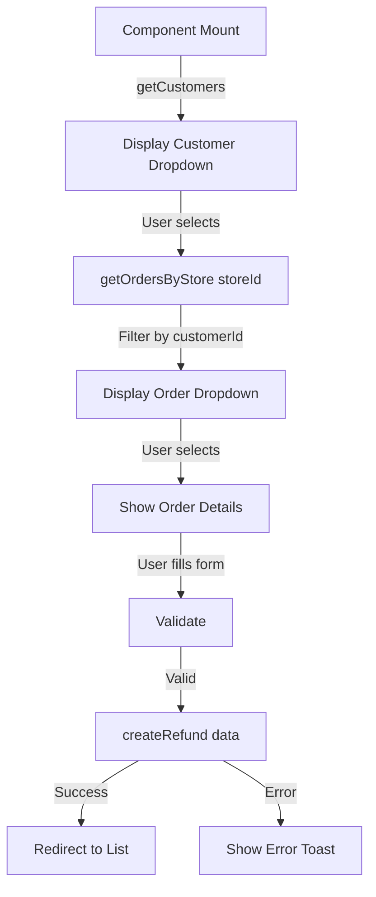

# Refund System - Quick Reference

## Command Component Installation

```powershell
pnpm dlx shadcn@latest add command
```

## Access Points

### Navigation

- **From Sidebar**: Cashier Menu → Refunds → "New Refund" button
- **Direct URL**: `/store/cashier/refunds/new`

## Step-by-Step User Flow

### Step 1: Select Customer

1. Click on "Select Customer" dropdown
2. Type to search by name, email, or phone
3. Select customer from list
4. Customer info displays below dropdown

### Step 2: Select Order

1. Order dropdown becomes enabled
2. Click "Select Order" dropdown
3. Search by order number or date
4. See order details: number, date, payment, items count, total
5. Select order from list

### Step 3: Review Order Details

- Automatically displays:
  - Order number and date
  - Payment method and status
  - Complete item breakdown
  - Subtotal, tax, discount, total
- Refund amount pre-filled with order total

### Step 4: Enter Refund Details

1. **Refund Amount**: Edit if partial refund needed
2. **Refund Reason**: Type detailed explanation
3. Click "Process Refund"

### Step 5: Confirmation

- Loading toast shows "Processing refund..."
- Success toast: "Refund processed successfully!"
- Auto-redirect to refunds list in 1.5 seconds

## Quick Validation Rules

| Field    | Rule                          |
| -------- | ----------------------------- |
| Customer | Must be selected              |
| Order    | Must be selected              |
| Amount   | Must be > 0 and ≤ order total |
| Reason   | Cannot be empty               |

## Component Architecture

```
app/(dashboard)/store/cashier/refunds/new/page.tsx (Server)
└── Fetches user and storeId
    └── <ReturnRefundFormClient userId storeId> (Client)
        ├── Fetches customers on mount
        ├── Fetches orders when customer selected
        └── Submits refund to server action
```

## Server Actions Flow



## Key Files Modified

1. **`components/cashier/refunds/ReturnRefundFormClient.tsx`**

   - Complete rewrite with Command components
   - Customer and order selection
   - Order details display
   - Form validation and submission

2. **`app/(dashboard)/store/cashier/refunds/new/page.tsx`**

   - Server component
   - Fetches user and storeId
   - Passes props to client component

3. **Documentation**
   - `REFUND-FORM-README.md` - Detailed implementation
   - `REFUND-SYSTEM-QUICK-REFERENCE.md` - This file

## Testing Checklist

- [ ] Customer dropdown loads and searches correctly
- [ ] Order dropdown disabled until customer selected
- [ ] Orders filtered correctly by customer
- [ ] Order details display all information
- [ ] Refund amount validates correctly
- [ ] Cannot submit without all required fields
- [ ] Success creates refund and redirects
- [ ] Error handling shows appropriate messages
- [ ] Clear form resets all fields
- [ ] Loading states prevent double submission

## Common Issues & Solutions

### Issue: "No orders found for this customer"

**Solution**: Customer has no completed orders in the system

### Issue: Order dropdown stays disabled

**Solution**: Select a customer first

### Issue: Refund amount validation fails

**Solution**:

- Check amount is a valid number
- Check amount doesn't exceed order total
- Check amount is greater than 0

### Issue: Form won't submit

**Solution**: Check all required fields:

- Customer selected? ✓
- Order selected? ✓
- Amount valid? ✓
- Reason filled? ✓

## Command Component Features

### What is Command?

A composable component for building searchable command menus, selects, and autocompletes.

### Key Features

- Built-in search/filter
- Keyboard navigation
- Accessible (ARIA labels)
- Customizable styling
- Supports complex item layouts

### Usage Pattern

```tsx
<Popover>
  <PopoverTrigger>
    <Button>Select...</Button>
  </PopoverTrigger>
  <PopoverContent>
    <Command>
      <CommandInput placeholder="Search..." />
      <CommandList>
        <CommandEmpty>No results.</CommandEmpty>
        <CommandGroup>
          <CommandItem onSelect={...}>
            Item content
          </CommandItem>
        </CommandGroup>
      </CommandList>
    </Command>
  </PopoverContent>
</Popover>
```

## API Integration

### Customers API

```typescript
GET /api/customers
Response: Customer[]
```

### Orders API

```typescript
GET /api/orders/store/{storeId}
Response: Order[]
// Filtered client-side by customerId
```

### Refunds API

```typescript
POST / api / refunds;
Body: {
  orderId: string;
  amount: number;
  reason: string;
}
Response: Refund;
```

## Keyboard Shortcuts (Command Component)

- **↑/↓**: Navigate items
- **Enter**: Select item
- **Esc**: Close dropdown
- **Type**: Filter/search items

## Mobile Responsiveness

- Dropdowns adapt to screen size
- Touch-friendly tap targets
- Scrollable command lists
- Responsive grid layouts
- Stack on small screens

## Accessibility

- ✅ ARIA labels on all interactive elements
- ✅ Keyboard navigation support
- ✅ Screen reader friendly
- ✅ Focus indicators
- ✅ Semantic HTML structure
- ✅ Disabled states clearly indicated

## Performance Notes

- Customers fetched once on mount
- Orders fetched only when customer selected
- Client-side filtering for instant search
- Minimal re-renders with proper state management
- Loading states prevent redundant requests
